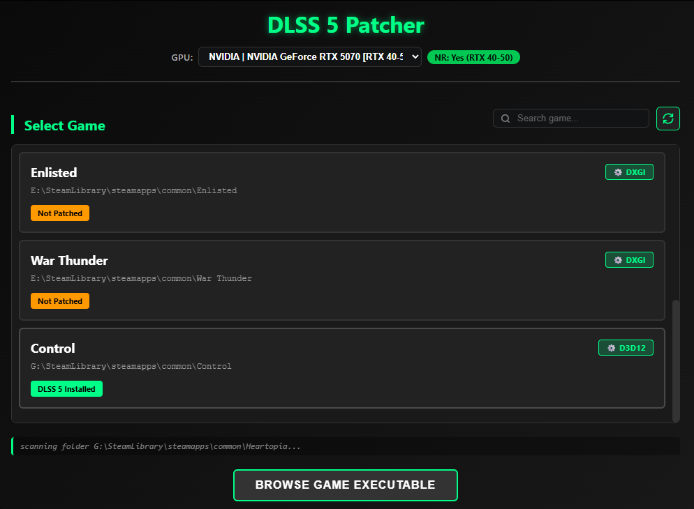
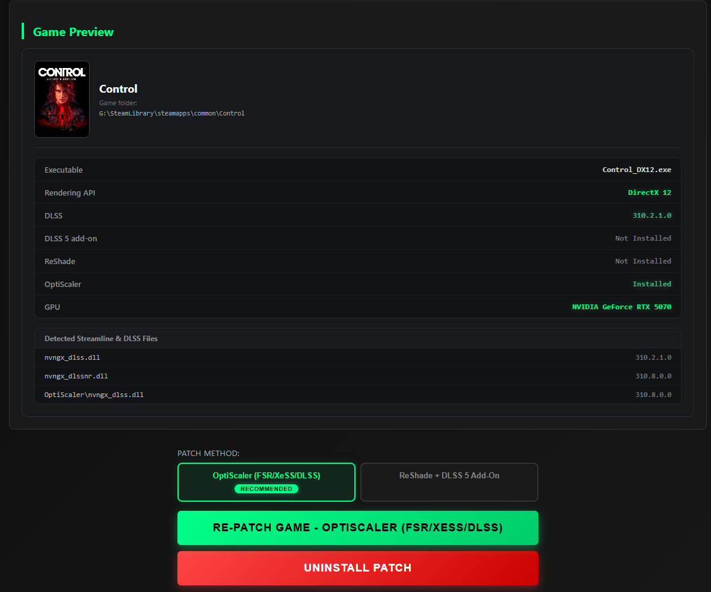

# DLSS 5 Patcher

DLSS 5 Neural Rendering patcher for Windows games **ReShade or OptiScaler, one click**. Built with Wails v2 (Go + Vanilla JS).

<p align="center">
  
</p>

### ReShade + DLSS 5 Add-On
Best for DX11 / DX12 / Vulkan with full ReShade control.
- Installs ReShade with Addon Support and DLSS 5 add-ons (RenoDX + optional Feeder)
- Native-DLSS games automatically use Direct path without Feeder to avoid conflicts
- Pre-configured iMMERSE: Launchpad and DLSS 5 Feed preset, no manual in-game setup

### DirectX 8 / 9 & 32-bit Games
Old games work too, fully automatic.
- **DX8 / DX9 via dgVoodoo2 bridge**: D3D8/D3D9 is transparently bridged to D3D11 (or D3D12, selectable in Settings), then ReShade + DLSS 5 on top. Game-shipped wrappers are backed up and restored on uninstall.
- **32-bit via DLSS5-Feeder**: 32-bit games get the split-process route — `addon32` next to the exe plus a `host64\` helper folder (64-bit ReShade, neural consumer, NGX runtimes) that starts by itself in-game.
- **Robust detection for old executables**: bitness and render API are parsed without relying on strict PE readers, so classics like GTA Vice City are classified correctly (32-bit, D3D8).

### Neural Consumer Choice
Pick the add-on that does the DLSS 5 work in Settings: **RenoDX DLSS 5** (default) or **Deep Fried Chicken** (add-on + private NGX bridge + config). Switching and re-patching automatically removes the other one so they never conflict.

### Verify & Repair
Built-in port of `Verify-DLSS5Feeder.ps1`: 15+ checks (ReShade build/bitness, feeder files, `host64\`, neural consumer, NGX runtimes, `d3dcompiler` trap, preset + motion-vector provider, GPU/driver).
- Runs automatically after every patch and **auto-repairs** missing/misplaced files.
- **Verify** / auto-**Repair** buttons on every patched game, with a per-check breakdown.
- Needs-you warnings (never auto-"fixed"): NVIDIA driver below the **616.56** minimum for neural rendering.

### OptiScaler (FSR / XeSS / DLSS)
Best for broad API coverage, including Vulkan and DX11.
- Proxy DLL `dxgi.dll` with automatic backend selection
- Auto-tuned configuration, works where ReShade is limited

### Common Features
- **Multi-drive, multi-platform detection**: scans every active drive, Steam libraries, Epic, Ubisoft Connect, GOG Galaxy, EA/Origin, and Xbox Games. Games appear live as they are found.
- **Deep clean uninstall**: scans every subdirectory and restores originals from backup.
- **Live progress & patch flow**: real-time status during patch and uninstall, and one-click launch after patching.

## Easy to Use

Just select a game, choose a mode, and click **Patch**. The app handles everything else automatically, including ReShade/OptiScaler installation, DLSS 5 add-ons, and config tweaks.

<p align="center">
  
</p>

---

### Download App: [DLSS.5.Patcher.Portable.v1.2.1.exe](https://github.com/MRHRTZ/DLSS5-Patcher/releases/download/v1.2.1/DLSS.5.Patcher.Portable.v1.2.1.exe)

---

# Development
```bash
wails dev   # from src/
```

### Build & Deploy
```bash
wails build   # from src/
```
The binary is generated at `src/build/bin/DLSS 5 Patcher.exe`. Copy it to the workspace root.
For a versioned release build + packaging, run `build.bat` at the root (hardcoded `VERSION` at the top) — it builds, names the exe `DLSS 5 Patcher v<VERSION>.exe`, and drops the main + per-dataset zips into `build/<VERSION>/`.

## Project Structure
```
DLSS 5 Setup/
├── DLSS 5 Patcher.exe         # Production launcher
├── config.json                # Unified config (gpu_selection, reshade_setup_url, reshade_url, optiscaler_url, dlss5_url)
├── data/
│   ├── reshade-setup/         # ReShade with Addon Support
│   │   ├── Extracted/         # Pre-extracted ReShade64.dll & manifests
│   │   └── ReShade_Setup_6.8.0_Addon.exe  # Auto-downloaded from config if missing
│   ├── reshade/               # ReShade DLSS 5 add-ons & shaders
│   │   ├── dlss5-feed.addon64
│   │   ├── renodx-dlss5/      # RenoDX DLSS 5 consumer set
│   │   │   └── renodx-dlss5.addon64
│   │   ├── deep-fried-chicken/  # Deep Fried Chicken consumer set
│   │   │   ├── deep-fried-chicken.addon64
│   │   │   ├── deep-fried-chicken-nvngx.dll
│   │   │   └── deep-fried-chicken.cfg
│   │   └── reshade-shaders-source/
│   ├── feeder/                # DLSS5-Feeder release (32-bit route)
│   │   ├── dlss5-feed.addon32
│   │   ├── dlss5-feed.addon64
│   │   ├── host64/dlss5-feed-host64.exe
│   │   └── reshade-shaders/Shaders/DLSS5_Feed.fx
│   ├── dgvoodoo/              # dgVoodoo2 D3D8/D3D9 bridge (MS/x86, MS/x64)
│   ├── optiscaler/            # OptiScaler proxy + backends
│   │   ├── OptiScaler.dll
│   │   ├── OptiScaler.ini.default
│   │   └── OptiScaler/        # libxess, amd_fidelityfx_*, D3D12_OptiScaler/
│   └── dlss5/                 # Shared DLSS Neural Rendering DLLs
│       ├── nvngx_dlss.dll
│       ├── nvngx_dlssnr.dll
│       └── nvngx.dll_dlssnr.dll
├── patcher.log                # Operation log
└── src/                       # Wails application source
```

## Configuration

`config.json` is auto-created if missing. Leave a `*_url` empty to show an error dialog instead of silently failing. `reshade_setup_url` supports direct `.exe` URLs:

```json
{
  "gpu_selection": "",
  "reshade_setup_url": "https://reshade.me/downloads/ReShade_Setup_6.8.0_Addon.exe",
  "reshade_url": "",
  "optiscaler_url": "",
  "dlss5_url": "",
  "dgvoodoo_url": "https://github.com/dege-diosg/dgVoodoo2/releases/download/v2.87.4/dgVoodoo2_87_4.zip",
  "dgvoodoo_api": "d3d11",
  "feeder_url": "https://github.com/jlrouzies-fr/DLSS5-Feeder/releases/download/v0.13.1-beta.1/DLSS5-Feeder-0.13.1-beta.1.zip",
  "neural_consumer": "renodx"
}
```

## Changelog

See [RELEASE NOTES](https://github.com/MRHRTZ/DLSS5-Patcher/releases) for full details.

## License
This project is licensed under the MIT License. See the [LICENSE](https://mit-license.org) file for details.

## Thanks To
- [DLSS5-Feeder](https://github.com/jlrouzies-fr/DLSS5-Feeder) — feeder add-on, verify methodology, and the 32-bit `host64` route this patcher automates.
- [OptiScaler DLSSNR](https://github.com/Dagherbou/OptiScaler_DLSSNR/releases) — OptiScaler builds with neural rendering support used by the OptiScaler patch mode.